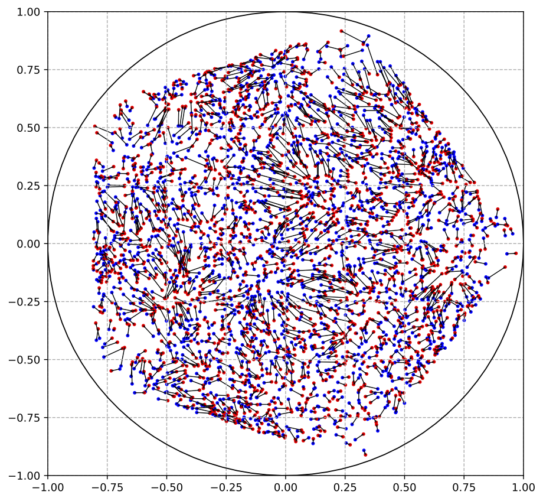

 
Here you can find visuals from my past or current research.
 
 

<table>
  <tr>

    <td>
 <iframe style="  position: absolute;
      top: 0;
      left: 0;
      bottom: 0;
      right: 0;
      width: 100%;
      height: 100%;" title="Jewel" frameborder="0" allowfullscreen mozallowfullscreen="true" webkitallowfullscreen="true" allow="autoplay; fullscreen; xr-spatial-tracking" xr-spatial-tracking execution-while-out-of-viewport execution-while-not-rendered web-share src="https://sketchfab.com/models/77038e94cc5f4053a0d62f2d50316256/embed?autospin=1"> </iframe>  
 
Jewel - sample of \( \mathcal{C}_3 \) in the \( \text{IPVT} \) of \(\mathbb{H}_3 \), ball model (<a href="./ipvt" target="_blank">more</a>)
</td>

        <td>
        
 <iframe style="  position: absolute;
        top: 0;
        left: 0;
        bottom: 0;
        right: 0;
        width: 100%;
        height: 100%;" title="Foam" frameborder="0" allowfullscreen mozallowfullscreen="true" webkitallowfullscreen="true" allow="autoplay; fullscreen; xr-spatial-tracking" xr-spatial-tracking execution-while-out-of-viewport execution-while-not-rendered web-share src="https://sketchfab.com/models/d5a6b8aac322480eb8ead3efe18d9e74/embed"> </iframe>

          
Foam - sample of \( \partial\mathcal{C}_3 \) in the \( \text{IPVT} \) of \(\mathbb{H}_3 \), UHS model (<a href="./ipvt" target="_blank">more</a>)

        </td>
   </tr>
   <tr>

      <td>

      
An optimal assignment in a regular pentagon

  </td>
  </tr>
   <tr>

      <td>

      
Near critical configuration of ferromagnetic n.n. \( XY \)   model in \( [0,33]^2 \) with free boundary conditions

  </td>
  </tr>

  <tr>

     <td>

     
The quasi-periodic structure of the spectrum of    certain random matrices under investigation

 </td>
 </tr>

</table>

<!--
My contributions so far have focused on ideal Poisson-Voronoi tessellations, local limits of massive spanning forests, Gibbs measures and specifications, renormalisation group for spin systems, random assignment problems and extensions.

For non-technical introductions to these topics see:
- [ideal Poisson-Voronoi tessellations]({{ site.baseurl }}ipvt)
- [local limits of massive spanning forests]({{ site.baseurl }}scientific-interests) (<i class="fa fa-wrench" aria-hidden="true"></i>...)
- [Gibbs measures and specifications, renormalisation group]({{ site.baseurl }}scientific-interests) (<i class="fa fa-wrench" aria-hidden="true"></i>...)
- [random assignment problems and extensions]({{ site.baseurl }}scientific-interests) (<i class="fa fa-wrench" aria-hidden="true"></i>...)

For my publication list, see [here]({{ site.baseurl }}publications). 
For a list of delivered or upcoming talks, see [here]({{ site.baseurl }}talks).

# Gallery
-->
